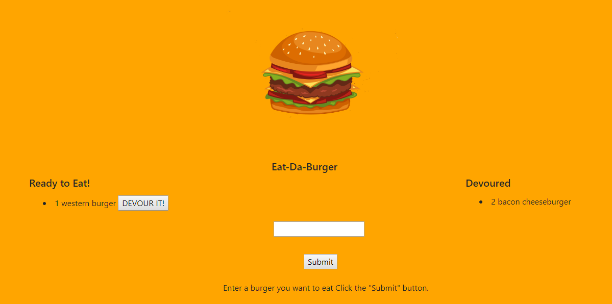

# burgerapp

# Homework Description

At the beginning, user is asked to enter a burger name as shown in the picture below:

User can enter multiple burgers (no input validation), click submit button, and than the burger is displayed in ready to eat column (shown below). Next to every entered burger, devour it button is displayed.

When user is clicked on devour it button, the burger is moved from the left ready to eat column to right devoured column (shown below).

# Homework Creation Process

This html web page was styled in bootstrap and css to make it mobile responsive. Back end was coded in javascript. Handlebars, express, and node.js packages were used for backend. The website was deployed to heroku server. 